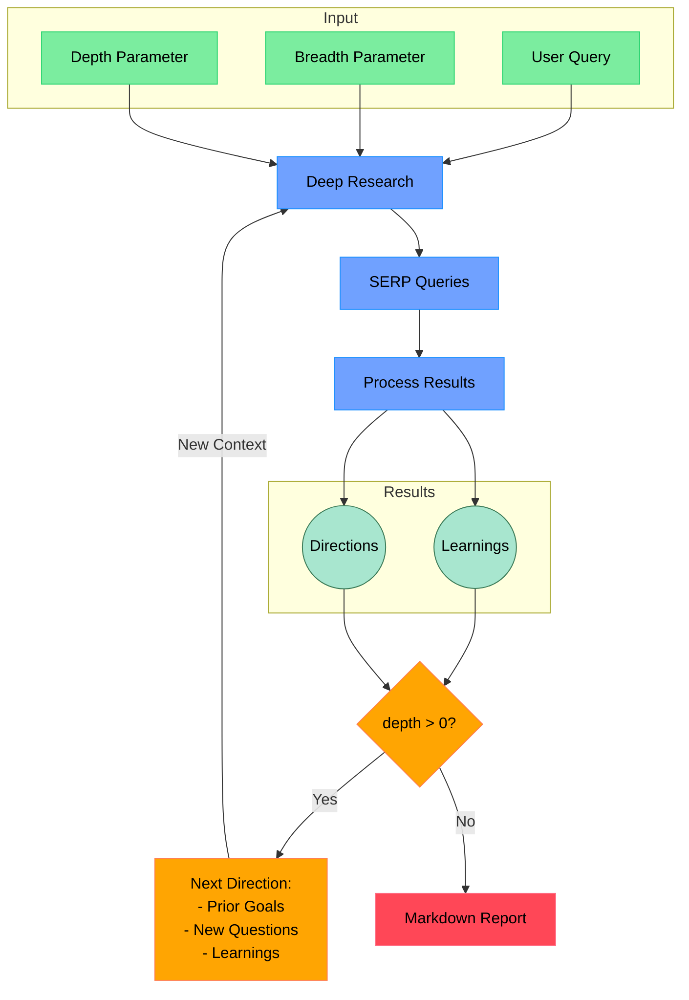

# Open Deep Research (Python Edition)

An AI-powered research assistant that performs iterative, deep research on any topic by combining search engines, web scraping, and large language models. This Python-based version builds on the original concept from [Aomni](https://aomni.com) ([GitHub](https://github.com/dzhng/deep-research)) with added compatibility for **DeepSeek**, **Google**, and **OpenAI** APIs. It’s designed to refine its research direction over time, deep-dive into topics, and generate comprehensive markdown reports.

---

## How It Works

Below is an overview of the deep research process:



---

## Features

- **Iterative Research**: Performs deep research by iteratively generating search queries, processing results, and diving deeper based on findings.
- **Multi-Engine Support**: Leverages DeepSeek, Google, and OpenAI APIs to source and analyze information.
- **Intelligent Query Generation**: Uses large language models (LLMs) to generate targeted queries based on research goals and previous findings.
- **Configurable Depth & Breadth**: Easily control how wide (breadth) and deep (depth) the research goes.
- **Dynamic Follow-ups**: Generates follow-up questions to continually refine research direction.
- **Comprehensive Reporting**: Produces detailed markdown reports with key findings and sources.
- **Python Simplicity**: A lean and accessible Python codebase for easy customization and integration.

---

## Requirements

- Python 3.11 or higher
- LLM API keys (choose):
  - **DeepSeek API**
  - **Google API** 
  - **OpenAI API** 
- Other API keys
  - **FireCrawl API** (for custom search)

---

## Setup

### 1. Clone the Repository

```bash
git clone https://github.com/carboni123/python-deep-research.git
cd python-deep-research
```

### 2. Create a Virtual Environment (Optional but Recommended)

```bash
python -m venv venv
source venv/bin/activate  # On Windows: venv\Scripts\activate
```

### 3. Install Dependencies

```bash
pip install -r requirements.txt
```

### 4. Configure Environment Variables

Create a `.env` file in the project root and add your API keys and any custom settings:

```dotenv
# API keys
LLM_CLIENT="openai" # ["openai", "deepseek", "google"]
DEEPSEEK_KEY="your_deepseek_key"
GOOGLEAI_API_KEY="your_google_api_key"
OPENAI_KEY="your_openai_key"
FIRECRAWL_API="your_firecrawl_key"

# Optional: Custom endpoints or models
# OPENAI_MODEL="your_custom_model"
# DEEPSEEK_MODEL="your_custom_model"
# GOOGLEAI_MODEL="your_custom_model"
```

---

## Usage

Run the research assistant with:

```bash
python main.py
```

You will be prompted to:

1. **Enter Your Research Query**: What topic would you like to explore?
2. **Specify Research Breadth**: (e.g., number of parallel searches; recommended: 3–10, default: 4)
3. **Specify Research Depth**: (e.g., number of recursive research iterations; recommended: 1–5, default: 2)
4. **Answer Follow-up Questions**: Help refine the research direction based on previous findings.

The system will then:

- Generate and execute search queries across supported platforms (OpenAI, DeepSeek, Google).
- Process and analyze the search results with the help of the OpenAI API.
- Recursively dive deeper based on evolving research directions.
- Compile everything into a comprehensive markdown report, saved as `output.md` in your working directory.

---

## Customization & Concurrency

- **Concurrency Settings**:  
  If you’re using a paid API plan or have a local deployment of any of the services, you can adjust the concurrency settings (e.g., in the configuration file or within the code) to improve performance. Note that free-tier accounts may have rate limits.

- **Custom Endpoints and Models**:  
  You can override default API endpoints or model settings using additional environment variables (see the sample in the `.env` file).

---

## How It Works (Detailed)

1. **Initial Setup**  
   - The assistant takes in the user query along with the breadth and depth parameters.
   - It generates initial follow-up questions to better understand the research needs.

2. **Deep Research Process**  
   - Multiple search queries are generated based on the research goals.
   - Results from DeepSeek and Google are aggregated and processed.
   - Key learnings are extracted and used to determine further research directions.

3. **Recursive Exploration**  
   - If the specified depth is greater than zero, the system recursively refines the research using prior goals, new questions, and accumulated learnings.
   - Each iteration builds on the context provided by previous findings.

4. **Report Generation**  
   - Finally, all findings are compiled into a clear and detailed markdown report.
   - The report includes sources and organized insights for easy review.

---

## License

This project is licensed under the [MIT License](LICENSE). Feel free to use and modify it as needed.

---

*Happy researching!*
